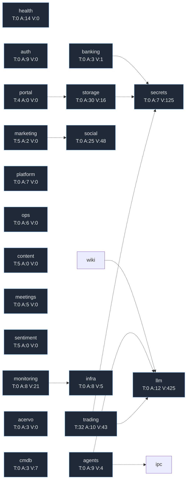

# Taxonomy Domain Map

**Generated:** 2026-07-24T20:01:32.531020

Diagrama Mermaid dos hubs de domínio (contagens do grafo).

Ver também: [docs/taxonomy/GRAPH.md](../docs/taxonomy/GRAPH.md), `graph.json`, [TAXONOMY_QUICK_START.md](../TAXONOMY_QUICK_START.md).
