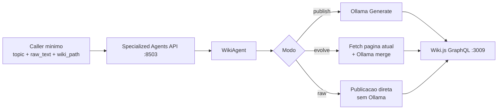

# Wiki Agent com Ollama (GPU-first) — Implementação e Deploy

## Resumo Executivo

Foi implementado um agente especializado de Wiki integrado ao `specialized-agents-api` com foco em:

- reduzir consumo de tokens do caller (input mínimo)
- usar Ollama local no homelab como motor de expansão/evolução de conteúdo
- publicar diretamente no Wiki.js por GraphQL
- manter fallback de GPU na ordem GPU0 -> GPU1

Status final desta entrega:

- implementação concluída
- testes unitários aprovados
- deploy em homelab realizado
- serviço reiniciado
- endpoints Wiki validados em produção

## Objetivo da Solução

Permitir que o caller envie apenas contexto essencial:

- `topic`
- `raw_text` (ou `new_info`)
- `wiki_path`

E delegar ao agente Wiki:

- expansão técnica em markdown completo (quando aplicável)
- evolução incremental de páginas existentes
- criação/atualização de página no Wiki.js

## Arquitetura



### Componentes relevantes

- API FastAPI: `specialized_agents/api.py`
- Agente Wiki: `specialized_agents/wiki_agent.py`
- Testes: `tests/test_wiki_agent.py`

## Implementação Técnica

### 1) Novo agente `wiki_agent.py`

Principais capacidades:

- seleção de Ollama com fallback `GPU0 -> GPU1`
- resolução dinâmica de modelo (`OLLAMA_MODEL` prioritário; fallback para primeiro disponível)
- geração/evolução de markdown via `/api/chat`
- integração GraphQL com Wiki.js (create/update/get)
- endpoint de saúde com status das duas GPUs

Modelos de request/response:

- `WikiPublishRequest`
  - `topic: str`
  - `raw_text: str`
  - `wiki_path: str`
  - `tags: list[str]`
  - `skip_ollama: bool = False`
- `WikiEvolveRequest`
  - `wiki_path: str`
  - `new_info: str`
  - `tags: list[str]`
- `WikiResponse`
  - `ok: bool`
  - `page_id: int | None`
  - `wiki_path: str | None`
  - `model_used: str | None`
  - `gpu: str | None`
  - `message: str`

### 2) Registro do router na API principal

Foi adicionado o include do router Wiki em `specialized_agents/api.py`:

- import de `wiki_router`
- `app.include_router(wiki_router, prefix="/wiki", tags=["wiki"])`
- log de sucesso/fallback

### 3) Endpoints expostos

- `GET /wiki/health`
- `POST /wiki/publish`
- `POST /wiki/evolve`
- `POST /wiki/raw`

## Política GPU-first

Fluxo obrigatório implementado:

1. tentar Ollama GPU0 (`http://192.168.15.2:11434`)
2. se indisponível, tentar Ollama GPU1 (`http://192.168.15.2:11435`)
3. se ambos indisponíveis, retornar HTTP 503

Isso garante uso preferencial de inferência local no homelab antes de qualquer alternativa externa.

## Integração Wiki.js

- Endpoint GraphQL: `http://192.168.15.2:3009/graphql`
- Autenticação: Bearer token (API key Wiki.js)
- Locale padrão: `en`
- Estratégia de persistência: upsert (create se inexistente, update se já existir)

## Cobertura de Testes

Arquivo: `tests/test_wiki_agent.py`

Escopo validado:

- seleção e fallback de GPU
- resolução de modelo
- geração Ollama
- operações GraphQL (get/create/update)
- endpoints FastAPI

Resultado executado:

- `20 passed`

## Deploy e Operação

### Deploy efetivo

- arquivos sincronizados para produção em:
  - `/home/homelab/myClaude/specialized_agents/wiki_agent.py`
  - `/home/homelab/myClaude/specialized_agents/api.py`
- serviço reiniciado:
  - `specialized-agents-api`

### Verificações de produção

Saúde do agente Wiki:

```json
{
  "status": "ok",
  "wiki_url": "http://192.168.15.2:3009/graphql",
  "ollama_gpu0": "up",
  "ollama_gpu1": "up",
  "default_model": "phi4-mini"
}
```

Rotas confirmadas no OpenAPI:

- `/wiki/health`
- `/wiki/publish`
- `/wiki/evolve`
- `/wiki/raw`

## Como usar (caller mínimo)

### Publicar com expansão via Ollama

```bash
curl -X POST http://localhost:8503/wiki/publish \
  -H "Content-Type: application/json" \
  -d '{
    "topic": "Nome do assunto",
    "raw_text": "Notas brutas do tema...",
    "wiki_path": "homelab/agents/exemplo",
    "tags": ["homelab", "wiki-agent"]
  }'
```

### Evoluir página existente

```bash
curl -X POST http://localhost:8503/wiki/evolve \
  -H "Content-Type: application/json" \
  -d '{
    "wiki_path": "homelab/agents/exemplo",
    "new_info": "Novas evidências, mudanças, resultados...",
    "tags": ["update"]
  }'
```

### Publicar conteúdo já pronto (sem Ollama)

```bash
curl -X POST http://localhost:8503/wiki/raw \
  -H "Content-Type: application/json" \
  -d '{
    "topic": "Documento Final",
    "raw_text": "# Markdown final...",
    "wiki_path": "homelab/agents/documento-final",
    "tags": ["raw"]
  }'
```

## Troubleshooting

- `404 /wiki/*`:
  - verificar se `api.py` em produção contém `include_router` do Wiki
  - reiniciar `specialized-agents-api`
- `503 Nenhum Ollama disponível`:
  - checar `http://192.168.15.2:11434/api/tags`
  - checar `http://192.168.15.2:11435/api/tags`
- erro GraphQL:
  - validar token Wiki.js
  - validar endpoint `/graphql`

## Histórico

- 2026-05-03: criação do agente Wiki, integração na API, testes unitários, deploy no homelab e validação em produção.
