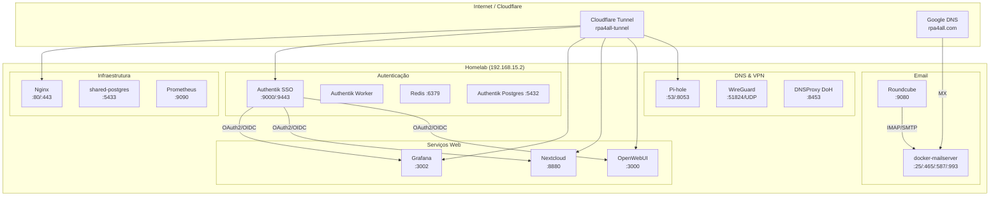

# Authentik SSO + WireGuard VPN + Email — Implementação Homelab

**Data:** 2026-03-04  
**Atualizado:** 2026-03-04  
**Status:** ✅ Implementado e testado

## Visão Geral

Centralização de autenticação via Authentik SSO (OpenID Connect / OAuth2) para todos os serviços web do homelab, servidor de email self-hosted (@rpa4all.com), e acesso remoto seguro via WireGuard VPN.



## Componentes

### Authentik SSO (auth.rpa4all.com)

| Item | Valor |
|------|-------|
| URL | https://auth.rpa4all.com |
| Versão | 2024.12 |
| Admin | akadmin |
| API Token | ak-homelab-authentik-api-2026 |
| Compose | /mnt/raid1/authentik/docker-compose.yml |
| DB | authentik-postgres (PostgreSQL 16) em /mnt/disk2/authentik-db |
| Cache | authentik-redis (Redis 7 Alpine) |

**Containers:** authentik-server (:9000/:9443), authentik-worker, authentik-redis, authentik-postgres

### Integrações OAuth2/OIDC

| Serviço | Client ID | Redirect URI | Status |
|---------|-----------|-------------|--------|
| Nextcloud | authentik-nextcloud | /apps/user_oidc/code | ✅ user_oidc v8.5.0 |
| Grafana | authentik-grafana | /login/generic_oauth | ✅ Botão "Authentik" no login |
| OpenWebUI | authentik-openwebui | /oauth/oidc/callback | ✅ OIDC habilitado |

**Discovery endpoints:**
- Nextcloud: `https://auth.rpa4all.com/application/o/nextcloud/.well-known/openid-configuration`
- Grafana: `https://auth.rpa4all.com/application/o/grafana/.well-known/openid-configuration`
- OpenWebUI: `https://auth.rpa4all.com/application/o/openwebui/.well-known/openid-configuration`

### WireGuard VPN

| Item | Valor |
|------|-------|
| Interface | wg0 |
| Subnet | 10.66.66.0/24 |
| Server IP | 10.66.66.1 |
| Porta | 51824/UDP |
| Config | /etc/wireguard/wg0.conf |

> Nota: o servidor WireGuard usa UDP `51824` internamente. O tráfego externo passa por um relay SSH/Cloudflare em TCP `51821`.

**Peers configurados:**

| Nome | IP VPN | Status |
|------|--------|--------|
| shared-client (PC) | 10.66.66.2 | Configurado |
| shared-phone (Android) | 10.66.66.3 | Ativo (handshake recente) |

**Rede:** IP forwarding habilitado, MASQUERADE ativo para enp1s0. Clientes VPN acessam todos os serviços via 192.168.15.2.

## Cloudflare Tunnel Routes

```yaml
# /etc/cloudflared/config.yml
ingress:
  - hostname: dns.rpa4all.com      → :8453
  - hostname: www.rpa4all.com      → :8090
  - hostname: openwebui.rpa4all.com → :3000
  - hostname: auth.rpa4all.com     → :9000  # Authentik
  - hostname: nextcloud.rpa4all.com → :8880
  - hostname: grafana.rpa4all.com  → :3002
  - hostname: rpa4all.com          → :8090
  - service: http_status:404
```

## Containers Ativos (13)

| Container | Status | Porta |
|-----------|--------|-------|
| authentik-server | ✅ healthy | 9000, 9443 |
| authentik-worker | ✅ healthy | — |
| authentik-redis | ✅ healthy | 6379 |
| authentik-postgres | ✅ healthy | 5432 |
| grafana | ✅ up | 127.0.0.1:3002→3000 |
| prometheus | ✅ up | 127.0.0.1:9090 |
| nextcloud | ✅ up | 8880→80 |
| nextcloud-db | ✅ healthy | 3306 |
| open-webui | ✅ healthy | 3000→8080 |
| roundcube | ✅ up | 9080→80 |
| mailserver | ✅ healthy | 25,143,465,587,993 |
| shared-postgres | ✅ up | 5433→5432 |
| pihole | ✅ healthy | 53, 8053→80 |

## Testes Realizados

- [x] auth.rpa4all.com → HTTP 200 (login flow)
- [x] OIDC discovery endpoints (3/3) → HTTP 200
- [x] nextcloud.rpa4all.com/login → HTTP 200
- [x] grafana.rpa4all.com/login → HTTP 200, botão "Authentik" presente
- [x] openwebui.rpa4all.com → HTTP 200
- [x] WireGuard wg0 UP, 2 peers, IP forwarding + NAT ativos
- [x] Todos 13 containers healthy/up

## Email Server (@rpa4all.com)

| Item | Valor |
|------|-------|
| Software | docker-mailserver v15.1.0 |
| Hostname | mail.rpa4all.com |
| Localização | /mnt/raid1/docker-mailserver/ |
| SSL | Self-signed (Let's Encrypt planejado) |
| Anti-spam | Rspamd |
| DKIM | ✅ Gerado (2048-bit RSA) |
| Webmail | Roundcube (:9080) |
| Stack | Postfix + Dovecot + Rspamd + Fail2Ban |

**Conta:** edenilson.paschoa@rpa4all.com  
**Documentação completa:** [docs/EMAIL_SERVER_SETUP.md](EMAIL_SERVER_SETUP.md)

### Portas do Email Server

| Porta | Protocolo | Função |
|-------|-----------|--------|
| 25 | SMTP | Recepção de email |
| 143 | IMAP | Leitura (sem TLS) |
| 465 | SMTPS | Envio criptografado |
| 587 | Submission | Envio autenticado |
| 993 | IMAPS | Leitura criptografada |
| 4190 | ManageSieve | Filtros de email |
| 9080 | HTTP | Roundcube webmail |

### Pendências Email
- [ ] DNS records (A, MX, SPF, DKIM, DMARC) no Google
- [ ] Let's Encrypt para mail.rpa4all.com
- [ ] Nginx reverse proxy
- [ ] PTR/rDNS com Vivo ISP
- [ ] Route Cloudflare para mail.rpa4all.com

## Credenciais (referência)

> ⚠️ Secrets armazenados em vault, não em texto claro.

- Authentik admin: `akadmin` / vault:authentik-admin-password
- Authentik user: `edenilson` (pk:7) / vault:authentik-edenilson-password
- Nextcloud user: `edenilson.paschoa@rpa4all.com` / vault:nextcloud-user-password
- Grafana admin: `admin` / vault:grafana-admin-password
- Email: `edenilson.paschoa@rpa4all.com` / vault:email-edenilson-password
- OAuth2 secrets: vault:authentik-{nextcloud,grafana,openwebui}-client-secret

## Troubleshooting

### Authentik "Invalid credentials"
Se o login via OAuth2 falhar com "Invalid credentials" no stage `default-authentication-password`:

```bash
# Verificar logs
sudo docker logs authentik-server --since 5m 2>&1 | grep -i "login_failed"

# Resetar senha via Django shell
sudo docker exec authentik-server ak shell -c \
  "from authentik.core.models import User; \
   u = User.objects.get(username='edenilson'); \
   u.set_password('NOVA_SENHA'); \
   u.save(); \
   print('OK')"
```

### Linux login ainda aceita senha local
Se o usuario do Linux existir localmente e estiver na allowlist `AUTHENTIK_LOGIN_ALLOW_LOCAL`,
o PAM vai permitir fallback para `pam_unix` e a senha local continuara funcionando.

Para endurecer a integracao e deixar o login do desktop/TTY dependente do Authentik:

```bash
sudo python3 /home/edenilson/eddie-auto-dev/tools/authentik_management/configure_authentik_os_strict.py \
  --env-file /etc/authentik/login-guard.env \
  --keep-local-users root,homelab \
  --auth-mode flow
```

Depois valide os arquivos PAM:

```bash
grep -n 'authentik-login-guard\|Managed by Shared Auto-Dev' /etc/pam.d/lightdm /etc/pam.d/login /etc/pam.d/sshd
```

### Grafana OAuth não funciona
1. Verificar Authentik → Applications → Grafana → Provider está ativo
2. Verificar Client ID/Secret no Grafana (env vars `GF_AUTH_GENERIC_OAUTH_*`)
3. Verificar redirect URI: `https://grafana.rpa4all.com/login/generic_oauth`
4. Verificar discover URL: `https://auth.rpa4all.com/application/o/grafana/.well-known/openid-configuration`

### Grafana admin password reset
```bash
sudo docker exec -it grafana grafana cli admin reset-admin-password NOVA_SENHA
```
