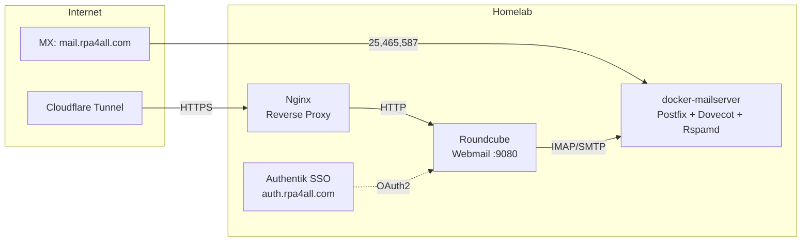
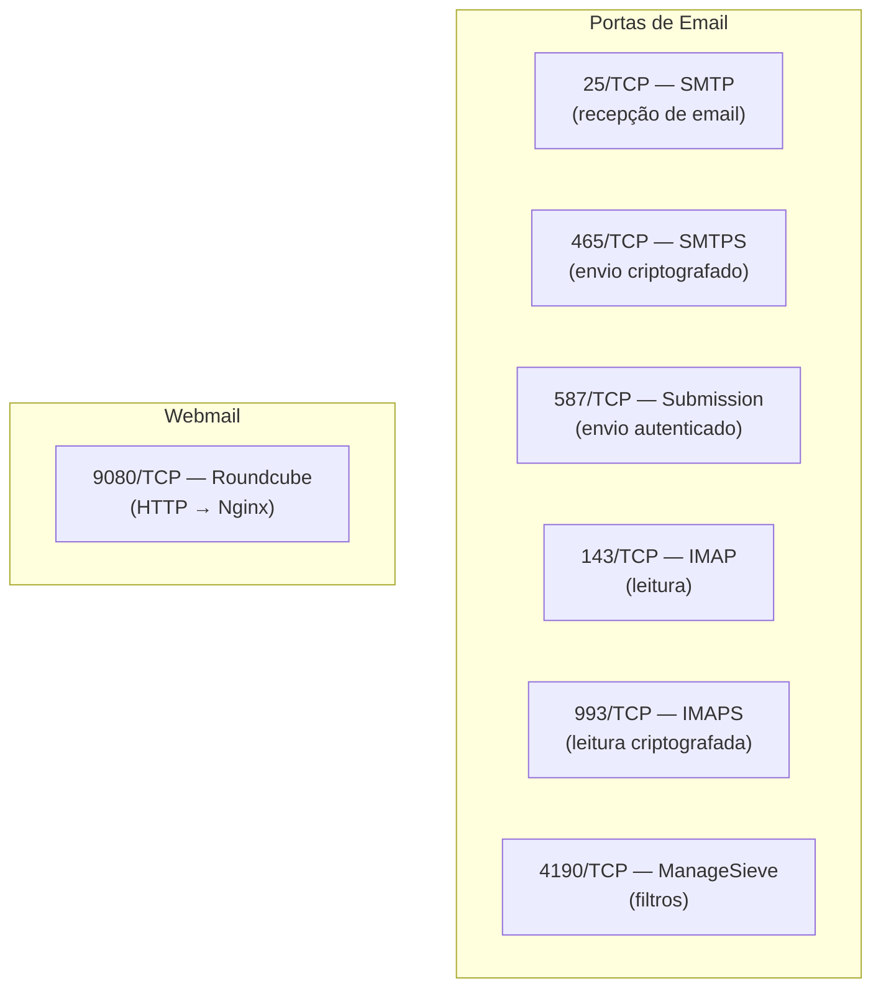

# 📧 Email Server — docker-mailserver + Roundcube

**Data:** 2026-03-04  
**Status:** ✅ Instalado e operacional  
**Domínio:** @rpa4all.com  
**Localização:** `/mnt/raid1/docker-mailserver/`

## Visão Geral

Servidor de email self-hosted no homelab usando [docker-mailserver](https://docker-mailserver.github.io/docker-mailserver/) v15.1.0 com webmail Roundcube, integrado ao ecossistema Shared via Authentik SSO e Cloudflare Tunnel.



## Componentes

| Componente | Versão | Container | Porta(s) | Status |
|------------|--------|-----------|----------|--------|
| docker-mailserver | v15.1.0 | `mailserver` | 25, 143, 465, 587, 993, 4190 | ✅ healthy |
| Roundcube | latest | `roundcube` | 9080→80 | ✅ up |
| Postfix | (bundled) | — | SMTP 25/465/587 | ✅ |
| Dovecot | (bundled) | — | IMAP 143/993 | ✅ |
| Rspamd | (bundled) | — | Anti-spam | ✅ |
| Fail2Ban | (bundled) | — | Proteção brute-force | ✅ |

## Arquitetura de Arquivos

```
/mnt/raid1/docker-mailserver/           # Raiz (RAID mergerfs, 585GB)
├── docker-compose.yml                   # Compose v3.8 (compat docker-compose v1)
├── mailserver.env                       # Configuração do mailserver
├── setup.sh                             # Script CLI de gerenciamento
├── nginx-mail.rpa4all.com.conf          # Config Nginx (pronta, não instalada)
└── data/
    └── dms/
        ├── mail-data/                   # Mailboxes (Maildir)
        ├── mail-state/                  # Estado do Postfix/Dovecot/Rspamd
        ├── mail-logs/                   # Logs do mail
        └── config/
            ├── postfix-accounts.cf      # Contas de email
            ├── opendkim/                # Chaves DKIM
            │   └── keys/
            │       └── rpa4all.com/
            │           ├── mail.private # Chave privada DKIM
            │           └── mail.txt     # Chave pública DKIM (para DNS)
            └── ssl/                     # Certificados SSL
                ├── mail.rpa4all.com-key.pem   # Chave privada
                ├── mail.rpa4all.com-cert.pem  # Certificado
                └── demoCA/
                    └── cacert.pem       # CA autoassinado
```

## Criação de Usuário no SO (Pré-requisito)

O usuário **`homelab`** (uid=1000) é o único administrador do servidor. Todos os demais usuários têm acesso **somente leitura**. O serviço de email roda sob este usuário.

### Usuário admin: `homelab`

```bash
# Já existente no servidor (uid=1000)
# Grupos: homelab, adm, cdrom, dip, plugdev, lxd, docker, libvirt, lpadmin, scanner, vboxusers
id homelab
# uid=1000(homelab) gid=1000(homelab) groups=1000(homelab),...,docker
```

### Criar usuários somente leitura (operadores/auditores)

```bash
# Criar usuário somente leitura (sem acesso docker, sem sudo)
sudo useradd -m -s /bin/bash -c "Email Operator (read-only)" mailoperator

# Definir senha
sudo passwd mailoperator

# NÃO adicionar ao grupo docker — sem permissão para gerenciar containers
# NÃO adicionar ao sudoers — sem elevação de privilégio

# Adicionar ao grupo adm apenas para leitura de logs (opcional)
sudo usermod -aG adm mailoperator
```

### Permissões do diretório do serviço

```bash
# Criar diretório base no RAID (se ainda não existir)
sudo mkdir -p /mnt/raid1/docker-mailserver

# Propriedade: homelab (admin único)
sudo chown -R homelab:homelab /mnt/raid1/docker-mailserver

# Permissões: dono total (rwx), grupo leitura (r-x), outros nenhum (---)
sudo chmod -R 750 /mnt/raid1/docker-mailserver
```

### Verificar permissões

```bash
# Confirmar que homelab é dono e tem acesso total
ls -la /mnt/raid1/docker-mailserver/
# drwxr-x--- homelab homelab ...

# Confirmar que homelab tem acesso ao Docker
docker ps

# Testar que usuário somente leitura NÃO consegue modificar
sudo -u mailoperator touch /mnt/raid1/docker-mailserver/test 2>&1
# touch: cannot touch '...': Permission denied  ✅

# Testar que usuário somente leitura NÃO controla Docker
sudo -u mailoperator docker ps 2>&1
# permission denied  ✅
```

### Política de acesso

| Usuário | Tipo | Docker | sudo | Escrita em `/mnt/raid1/` | Gerenciar email |
|---------|------|--------|------|--------------------------|-----------------|
| `homelab` | **Admin** | ✅ | ✅ | ✅ | ✅ |
| Demais | Leitura | ❌ | ❌ | ❌ | ❌ (apenas webmail) |

> **Regra:** Apenas `homelab` pode executar `docker-compose`, `setup.sh`, gerenciar contas de email e modificar configurações. Outros usuários acessam apenas via webmail (Roundcube) ou cliente IMAP.

> **Nota sobre Nextcloud:** A restrição de escrita em `/mnt/raid1/` se aplica ao acesso **direto no SO** (terminal/SSH). Usuários do Nextcloud continuam gravando arquivos normalmente via **web/WebDAV** (porta 8880), pois o container Docker roda internamente como `homelab` e gerencia o storage de forma independente. A mesma lógica vale para Roundcube (webmail) — o acesso é via HTTP, não via filesystem.

## Contas de Email

| Email | Criado em | Status |
|-------|-----------|--------|
| edenilson.paschoa@rpa4all.com | 2026-03-04 | ✅ Ativo |

## Configuração Principal

### docker-compose.yml

```yaml
version: "3.8"
services:
  mailserver:
    image: ghcr.io/docker-mailserver/docker-mailserver:latest
    container_name: mailserver
    hostname: mail.rpa4all.com
    ports:
      - "25:25"     # SMTP
      - "143:143"   # IMAP
      - "465:465"   # SMTPS
      - "587:587"   # Submission
      - "993:993"   # IMAPS
      - "4190:4190" # ManageSieve
    volumes:
      - ./data/dms/mail-data/:/var/mail/
      - ./data/dms/mail-state/:/var/mail-state/
      - ./data/dms/mail-logs/:/var/log/mail/
      - ./data/dms/config/:/tmp/docker-mailserver/
      - /etc/letsencrypt:/etc/letsencrypt:ro
      - /etc/localtime:/etc/localtime:ro
    env_file: mailserver.env
    restart: always
    healthcheck:
      test: ["CMD", "ss", "--listening", "--tcp", "--no-header", "|", "grep", "-q", "smtp"]
      interval: 30s
      timeout: 10s
      retries: 3

  roundcube:
    image: roundcube/roundcubemail:latest
    container_name: roundcube
    ports:
      - "9080:80"
    environment:
      ROUNDCUBEMAIL_DEFAULT_HOST: mailserver
      ROUNDCUBEMAIL_DEFAULT_PORT: 143
      ROUNDCUBEMAIL_SMTP_SERVER: mailserver
      ROUNDCUBEMAIL_SMTP_PORT: 587
    restart: always
```

### mailserver.env (resumo)

| Variável | Valor |
|----------|-------|
| `OVERRIDE_HOSTNAME` | mail.rpa4all.com |
| `SSL_TYPE` | self-signed |
| `ENABLE_RSPAMD` | 1 |
| `ENABLE_FAIL2BAN` | 1 |
| `ENABLE_IMAP` | 1 |
| `TZ` | America/Sao_Paulo |
| `POSTFIX_MESSAGE_SIZE_LIMIT` | 26214400 (25MB) |
| `ENABLE_SPAMASSASSIN` | 0 (usando Rspamd) |
| `ENABLE_CLAMAV` | 0 (economia de RAM) |

## Script de Gerenciamento (setup.sh)

```bash
# Instalar/atualizar
bash setup.sh install

# Gerenciar contas
bash setup.sh account add usuario@rpa4all.com senha
bash setup.sh account del usuario@rpa4all.com
bash setup.sh account list
bash setup.sh account-file    # Verificar arquivo de contas

# DKIM
bash setup.sh dkim            # Gerar chaves DKIM

# SSL
bash setup.sh cert            # Provisionar Let's Encrypt

# Operações
bash setup.sh start
bash setup.sh stop
bash setup.sh restart
bash setup.sh status
bash setup.sh logs [linhas]
bash setup.sh test            # Testar SMTP/IMAP

# DNS
bash setup.sh dns             # Mostrar registros DNS necessários
```

## DKIM (DomainKeys Identified Mail)

Chave DKIM gerada para `rpa4all.com`:

```
Registro DNS TXT: mail._domainkey.rpa4all.com
Valor: v=DKIM1; k=rsa; p=MIIBIjANBgkqhkiG9w0BAQEFAAOCAQ8AMIIBCgKCAQEAq+PclOAH8AWC2d09HYt4ujTdL+35r7vz1SrLDAIP1Bs3pjKEbIOQA7unmJyJrCXxZIbVnXiIU+oicaovWjBT1jToPM8TVvGI07tfw81/6hg56CYcmcIwxilO1D8tc5vzrvGKRgje9ulgzUb+3vHoRIr5//tbEknSR6exQJ4cScx4MI5iZuwWO/XpfZETbHKVb9uDTS6o+Seg+4X+nX7lq4JmhtiIVej8nqiMtUp+fOovkVXaI48aZf2pxdzgv/S7/vDgcdKgiNlXD5N7146KC7jegR0pBP0iVIXn93/OKP7WIF20kyqy9b58tueyJcdhZWdWEGMll6kNKvrNu1lsJwIDAQAB
```

## Registros DNS Necessários (Google DNS)

| Tipo | Nome | Valor | Prioridade | Status |
|------|------|-------|------------|--------|
| A | mail.rpa4all.com | 152.234.122.111 | — | ⏳ Pendente |
| AAAA | mail.rpa4all.com | 2804:7f0:9342:bca1:2e0:4cff:feb6:3d5e | — | ⏳ Pendente |
| MX | rpa4all.com | mail.rpa4all.com | 10 | ⏳ Pendente |
| TXT | rpa4all.com | v=spf1 mx a ip4:152.234.122.111 ~all | — | ⏳ Pendente |
| TXT | mail._domainkey.rpa4all.com | v=DKIM1; k=rsa; p=MIIBIjAN... | — | ⏳ Pendente |
| TXT | _dmarc.rpa4all.com | v=DMARC1; p=quarantine; rua=mailto:postmaster@rpa4all.com | — | ⏳ Pendente |
| CNAME | autoconfig.rpa4all.com | mail.rpa4all.com | — | ⏳ Pendente |
| CNAME | autodiscover.rpa4all.com | mail.rpa4all.com | — | ⏳ Pendente |

## SSL/TLS

| Status atual | Tipo | Validade |
|-------------|------|----------|
| ✅ Operacional | Self-signed | 10 anos |
| ⏳ Planejado | Let's Encrypt | Auto-renovação |

**Migração para Let's Encrypt:**
1. Configurar registro DNS A para `mail.rpa4all.com → 152.234.122.111`
2. Executar `bash setup.sh cert` (usa certbot)
3. Alterar `SSL_TYPE=letsencrypt` em `mailserver.env`
4. Reiniciar: `bash setup.sh restart`

## Nginx Reverse Proxy

Config pronta em `/mnt/raid1/docker-mailserver/nginx-mail.rpa4all.com.conf`:
- Proxy reverso para Roundcube webmail
- Autoconfig XML para Thunderbird
- Requer instalação em `/etc/nginx/sites-available/` + Let's Encrypt

**Instalação (após DNS):**
```bash
sudo cp /mnt/raid1/docker-mailserver/nginx-mail.rpa4all.com.conf /etc/nginx/sites-available/
sudo ln -s /etc/nginx/sites-available/nginx-mail.rpa4all.com.conf /etc/nginx/sites-enabled/
sudo certbot --nginx -d mail.rpa4all.com
sudo nginx -t && sudo systemctl reload nginx
```

## Protocolos e Portas



## Segurança

| Camada | Tecnologia | Status |
|--------|-----------|--------|
| Anti-spam | Rspamd | ✅ Ativo |
| DKIM | OpenDKIM (2048-bit RSA) | ✅ Chaves geradas |
| SPF | Registro TXT DNS | ⏳ Pendente |
| DMARC | Registro TXT DNS | ⏳ Pendente |
| Brute-force | Fail2Ban | ✅ Ativo |
| Criptografia | TLS (self-signed) | ✅ Ativo |
| Anti-vírus | ClamAV | ❌ Desabilitado (economia RAM) |

## Troubleshooting

```bash
# Status dos containers
cd /mnt/raid1/docker-mailserver && docker-compose ps

# Logs do mailserver
docker logs mailserver --tail 50

# Logs do Roundcube
docker logs roundcube --tail 50

# Testar SMTP
telnet localhost 25

# Testar IMAP
openssl s_client -connect localhost:993

# Verificar contas
docker exec mailserver setup email list

# Verificar DKIM
docker exec mailserver setup config dkim

# Verificar Rspamd
docker exec mailserver rspamc stat
```

## Próximos Passos

- [ ] Configurar registros DNS no Google
- [ ] Migrar para Let's Encrypt
- [ ] Instalar Nginx reverse proxy para webmail
- [ ] Solicitar PTR/rDNS à Vivo ISP
- [ ] Integrar Roundcube com Authentik SSO
- [ ] Configurar route Cloudflare para mail.rpa4all.com
- [ ] Testar envio/recepção de emails externos

## Referências

- [docker-mailserver docs](https://docker-mailserver.github.io/docker-mailserver/)
- [Roundcube docs](https://roundcube.net/docs/)
- [DKIM setup guide](https://docker-mailserver.github.io/docker-mailserver/latest/config/best-practices/dkim/)
