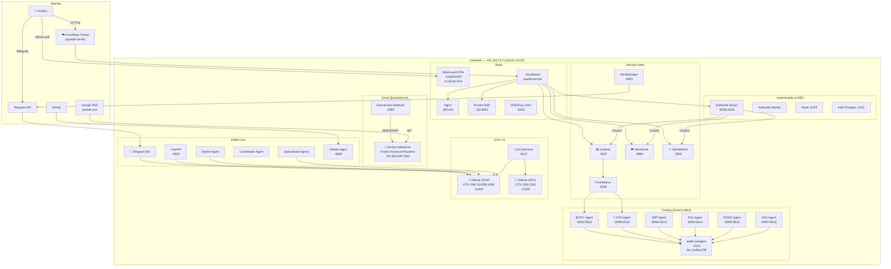
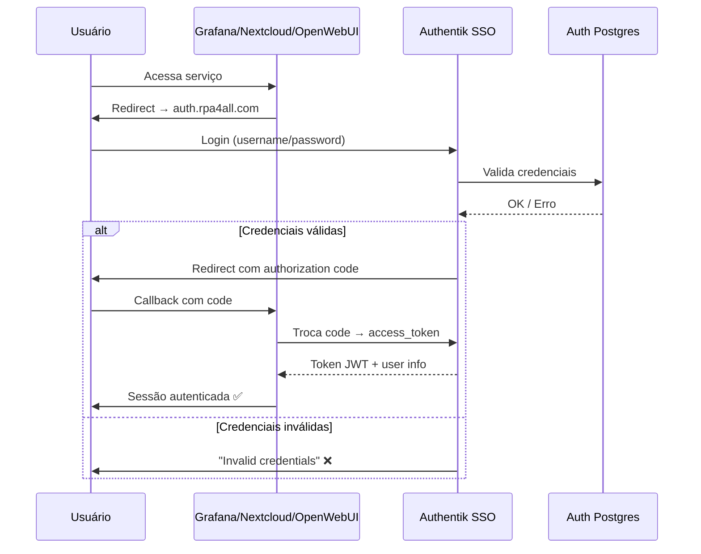
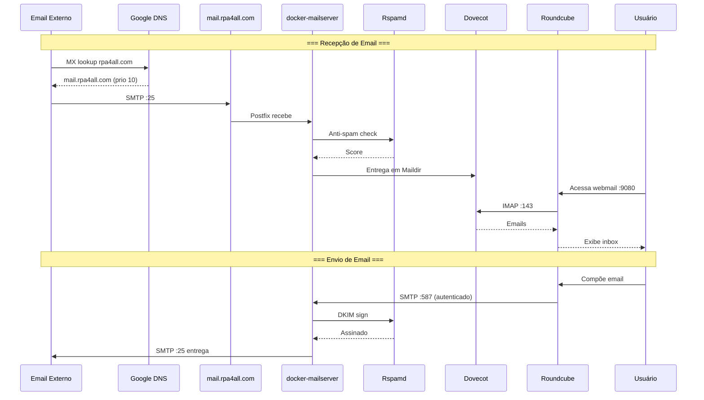
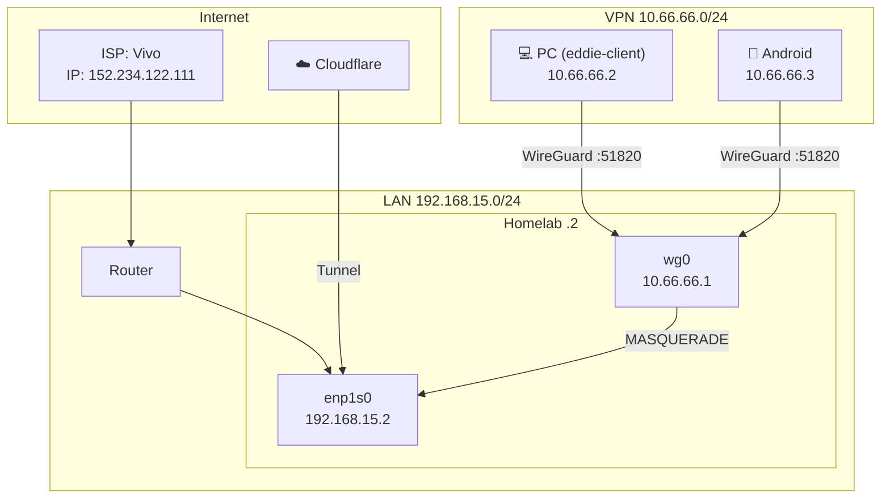
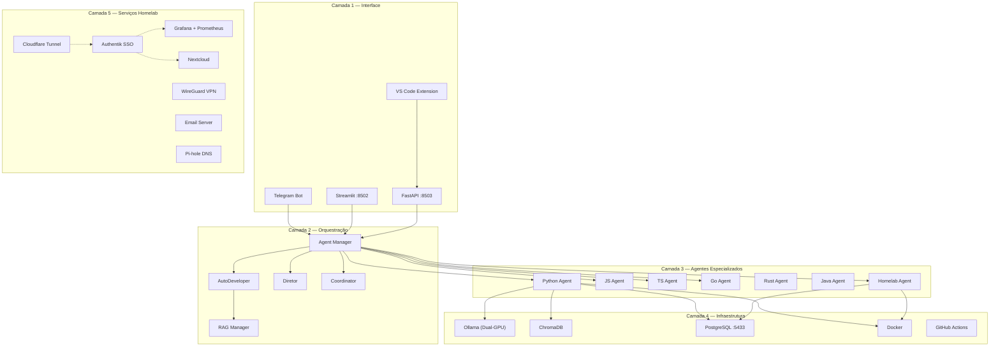
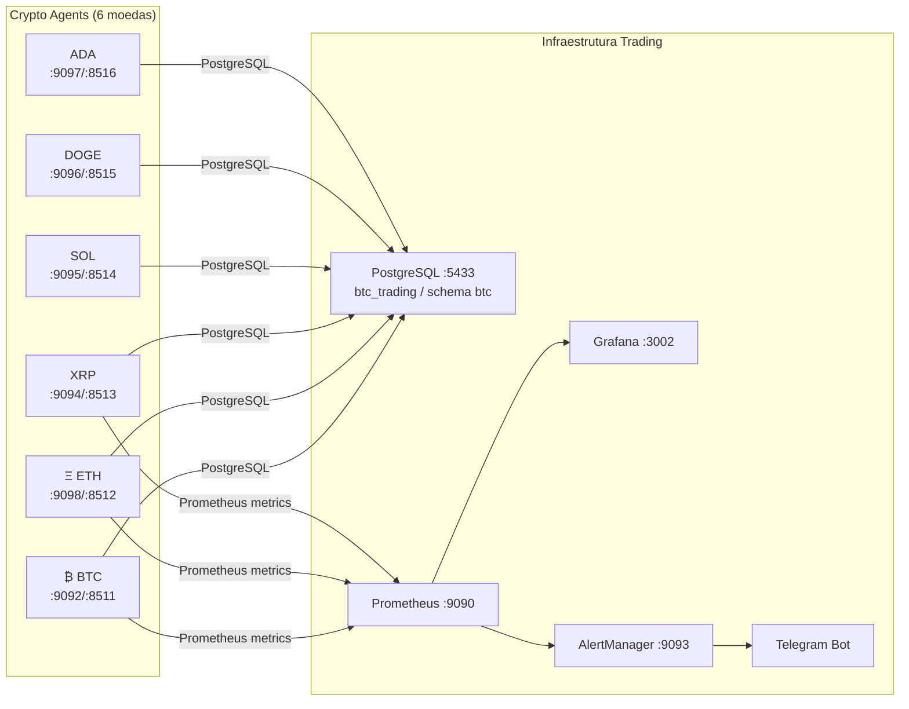
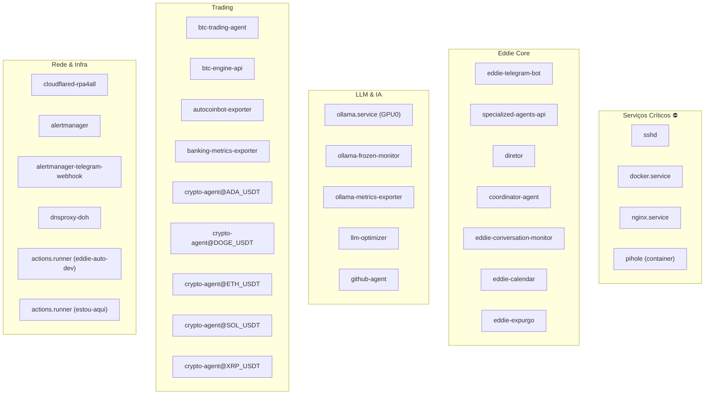
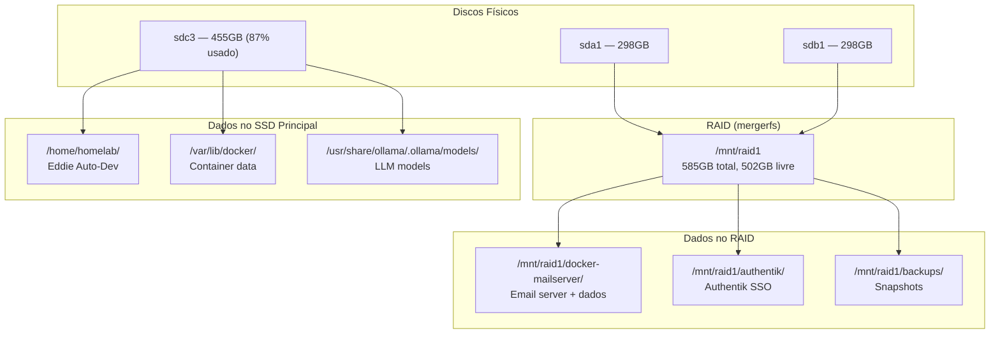
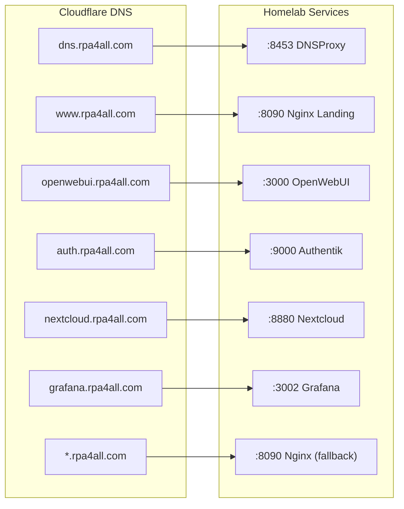

# 🏗️ Diagramas de Infraestrutura — Homelab Eddie

**Atualizado:** 2026-03-04

## 1. Visão Geral da Infraestrutura

## 2. Mapa de Portas

```mermaid
graph LR
    subgraph "Portas — Serviços Externos"
        direction TB
        E25["25 — SMTP"]
        E53["53 — DNS (Pi-hole)"]
        E80["80 — HTTP (Nginx)"]
        E143["143 — IMAP"]
        E443["443 — HTTPS (Nginx)"]
        E465["465 — SMTPS"]
        E587["587 — Submission"]
        E993["993 — IMAPS"]
        E3000["3000 — OpenWebUI"]
        E3002["3002 — Grafana"]
        E5433["5433 — PostgreSQL"]
        E8053["8053 — Pi-hole Web"]
        E8503["8503 — Eddie API"]
        E8880["8880 — Nextcloud"]
        E9000["9000 — Authentik"]
        E9080["9080 — Roundcube"]
        E9090["9090 — Prometheus"]
        E11434["11434 — Ollama GPU0"]
        E11435["11435 — Ollama GPU1"]
        E51820["51820/UDP — WireGuard"]
    end
```

## 3. Fluxo de Autenticação OAuth2

## 4. Fluxo de Email

## 5. Rede e VPN

## 6. Camadas do Sistema Eddie

## 7. Trading Multi-Coin

## 8. Serviços Systemd Ativos

## 9. Armazenamento

## 10. Cloudflare Tunnel Routes

