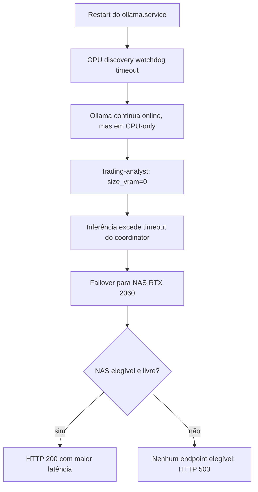
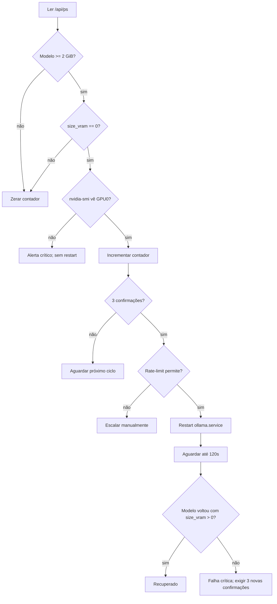

# Incidente 503 no Ollama Coordinator: GPU0 em CPU-only

**Data:** 2026-08-07  
**Host:** `192.168.15.2` (`homelab`)  
**GPU afetada:** GPU0, NVIDIA GeForce RTX 3060 12 GB  
**Serviços envolvidos:** `ollama.service`, `ollama-gpu-coordinator.service`, `ollama-gpu-selfheal.service`  
**Impacto:** timeouts no GPU0 e respostas 503 quando o NAS também estava ocupado  
**Status do incidente:** resolvido por restart manual aprovado  
**Status da prevenção:** implementada e testada no repositório; **não implantada no homelab**

## Resumo executivo

Após um restart do `ollama.service`, o watchdog de descoberta de GPU expirou. O Ollama continuou disponível na API, mas carregou `trading-analyst` integralmente em CPU (`size_vram=0`). A inferência do modelo 8B no i9-9900T excedia os timeouts do coordinator. O coordinator tentou failover para o NAS RTX 2060; quando o NAS estava ocupado, não havia endpoint elegível e os agentes recebiam HTTP 503.

O restart aprovado do `ollama.service` às 13:15:43 recuperou a descoberta CUDA. O modelo voltou com 33/33 camadas offloaded para a RTX 3060 e o coordinator retomou respostas 200.

Foi implementada uma prevenção no monitor root existente, `monitoring/ollama_gpu_selfheal.sh`: modelo grande com `size_vram=0` por três ciclos consecutivos aciona restart protegido por confirmação física da GPU, rate-limit e validação pós-restart. A mudança ainda não foi implantada.

## Linha do tempo

| Horário local | Evento |
|---|---|
| 12:29 | `ollama.service` reinicia no GPU0. |
| 12:30 | Watchdog de descoberta estoura após 30s; log registra `no usable GPU found`. |
| 12:30+ | `trading-analyst` sobe em CPU (`size_vram=0`); RTX 3060 permanece praticamente ociosa. |
| 13:02-13:03 | Requests ao GPU0 expiram; coordinator usa NAS quando possível. |
| 13:03:17 | NAS ocupado e nenhum endpoint elegível; coordinator responde 503. |
| 13:04:09 | Coordinator está ativo novamente, mas a causa no GPU0 permanece. |
| 13:15:43 | Restart aprovado de `ollama.service`. |
| 13:15:34+ | Descoberta CUDA encontra a RTX 3060; modelo começa a carregar. |
| 13:16:40 | Log confirma `offloaded 33/33 layers to GPU`. |
| 13:17+ | Coordinator volta a rotear `trading-analyst` para GPU0 com HTTP 200. |

## Cadeia causal



## Evidências do diagnóstico

### Ollama em CPU-only

- Log: `GPU discovery watchdog timed out`.
- Log: `warning: no usable GPU found, --gpu-layers option will be ignored`.
- `/api/ps`: `trading-analyst` carregado com `size_vram=0`.
- `nvidia-smi`: RTX 3060 visível pelo driver, porém sem carga correspondente ao modelo.

### Coordinator

- Cinco timeouts consecutivos no endpoint `gpu0-rtx3060`.
- Failover para o NAS quando disponível.
- `nenhum endpoint elegível para model=trading-analyst` no evento que gerou 503.

### Recuperação

- `ollama.service` ativo desde 13:15:43.
- Log: `inference compute id=0 ... NVIDIA GeForce RTX 3060`.
- Log: `offloaded 33/33 layers to GPU`.
- Processo `llama-server` iniciado com `-ngl 99`.
- `nvidia-smi`: 5357 MiB usados e 88% de utilização na RTX 3060.
- `/api/ps`: `size_vram=5456359587` para `trading-analyst`.
- Probe pelo coordinator: HTTP 200 em 1,1s.

## Causa raiz

O restart inicial do Ollama terminou antes de concluir uma descoberta CUDA utilizável. A API subiu normalmente, permitindo que healthchecks superficiais como `/api/version` e `/api/tags` passassem. O modelo foi então carregado em CPU.

O monitoramento existente detectava indisponibilidade de API, runner congelado e modelo leve pinado na GPU errada, mas não comparava `size` com `size_vram`. Por isso, tratava uma instância online em CPU-only como saudável ou apenas lenta.

## Fatores contribuintes

- Healthcheck de disponibilidade não verificava o dispositivo de execução.
- Inferência em CPU ainda podia responder, ocultando a falha até o timeout.
- O NAS era fallback compartilhado e podia estar ocupado.
- O selfheal Python retornava cedo quando o coordinator respondia `/api/version` com 200.
- Existiam dois selfheals com responsabilidades diferentes, tornando inadequado adicionar restart ao componente Python sem revisar privilégios.

## Itens descartados

- Erros PCIe `RxErr` da GTX 1050 em `04:00.0`: correctable e crônicos; não causaram o incidente na RTX 3060 em `01:00.0`.
- Queda do coordinator como causa primária: o coordinator voltou, mas os timeouts continuariam enquanto GPU0 estivesse em CPU-only.
- Mudança do trading para modo shadow: não ocorreu.

## Validação do trading

O profile chamado `shadow` é uma instância de perfil e não deve ser confundido com `OLLAMA_TRADE_PARAMS_MODE=shadow`.

As fontes de verdade mostraram:

- Todos os serviços `crypto-agent@*` com `OLLAMA_TRADE_PARAMS_MODE=apply`.
- 937 registros em `btc.ai_trade_controls` nas 24h analisadas: 937 `apply`, zero `shadow`.
- Na janela do incidente: 27 registros `apply`, zero `shadow`.
- Decisões HOLD/BUY continuaram sendo registradas.
- Trades reais (`dry_run=false`, `status=executed`) ocorreram após a recuperação.

Conclusão: o incidente degradou a disponibilidade das chamadas LLM, não o modo operacional do trading. O DCA controlado por IA permaneceu configurado como `apply`.

## Decisão de arquitetura

### Componente escolhido

A detecção foi implementada em `monitoring/ollama_gpu_selfheal.sh`, não em `tools/ollama_gpu_selfheal.py`.

Motivos:

- O monitor shell já roda como root e pode reiniciar `ollama.service`.
- Já possui estado persistente e `MAX_RESTARTS_HOUR`.
- Executa a cada 15s, adequado para confirmação em três ciclos.
- O Python roda como `homelab`, não possui autorização versionada para restart e retorna cedo quando o coordinator parece saudável.
- O Python mantém sua responsabilidade: remover modelos leves pinados no GPU0 e aquecer GPU1.

### Separação de responsabilidades

| Componente | Responsabilidade |
|---|---|
| `tools/ollama_gpu_selfheal.py` | Detectar e descarregar modelos leves pinados no GPU0. |
| `monitoring/ollama_gpu_selfheal.sh` | Saúde do runner, métricas GPU e recuperação de serviço/CPU-only. |

## Detecção implementada

GPU0 é considerada CPU-only quando:

1. `/api/ps` contém modelo carregado.
2. O modelo possui `size >= 2147483648` bytes (2 GiB).
3. O modelo possui `size_vram == 0`.
4. `nvidia-smi -i 0` confirma que a GPU física está visível.
5. A condição se repete em três ciclos consecutivos.

Um ciclo saudável zera o contador. Modelo leve, payload inválido ou GPU ociosa sem modelo não acionam restart.

Se `size_vram=0` e `nvidia-smi` não vê a GPU, o monitor registra erro crítico e bloqueia restart automático. Esse caso exige investigação de driver/hardware.

## Fluxo de recuperação implementado



## Configuração

| Variável | Default | Uso |
|---|---:|---|
| `CHECK_INTERVAL` | `15` | Intervalo entre ciclos do monitor. |
| `CPU_ONLY_CONFIRMATIONS` | `3` | Confirmações consecutivas antes do restart. |
| `CPU_ONLY_MIN_MODEL_BYTES` | `2147483648` | Tamanho mínimo para considerar o modelo relevante. |
| `MAX_RESTARTS_HOUR` | `3` | Limite compartilhado de restarts por GPU/hora. |
| `POST_RESTART_DELAY` | `15` | Espera inicial após `systemctl restart`. |
| `CPU_ONLY_RECOVERY_TIMEOUT` | `120` | Janela para o modelo voltar à VRAM. |
| `CPU_ONLY_RECOVERY_POLL` | `5` | Intervalo do polling pós-restart. |
| `STATE_DIR` | `/var/lib/ollama-selfheal` | Estado persistente; agora aceita override para testes. |

## Estado persistente

Novo arquivo por GPU:

```text
/var/lib/ollama-selfheal/gpu0_cpu_only_consecutive
```

O contador é zerado em estado saudável, GPU ausente, recuperação concluída ou após tentativa de restart. Depois de uma falha, são exigidas três novas confirmações antes de tentar novamente.

## Métricas Prometheus

Adicionadas ao textfile collector:

```text
ollama_gpu_cpu_only{gpu="gpu0"} 0|1
ollama_gpu_cpu_only_consecutive{gpu="gpu0"} N
```

Significado:

- `ollama_gpu_cpu_only=1`: modelo grande observado integralmente em CPU.
- `ollama_gpu_cpu_only_consecutive`: número de confirmações atuais; volta a zero após recuperação ou reset.

## Correções auxiliares

Durante os testes foram corrigidos dois problemas preexistentes:

- O script agora respeita override de `STATE_DIR`, preservando o default de produção.
- O entrypoint usa `BASH_SOURCE`, permitindo importar funções em testes sem iniciar o loop infinito.
- Modelos da família `nomic-bert` usam `/api/embeddings`; modelos generativos usam `/api/generate`. Isso evita falso frozen no GPU1.

## Testes automatizados

Arquivo: `tests/test_ollama_gpu_selfheal_script.py`.

Cobertura relevante:

- Modelo grande em CPU incrementa contador.
- Três ciclos acionam exatamente um restart.
- Recuperação só é declarada com `size_vram > 0`.
- Modelo saudável zera contador.
- Modelo leve em CPU não reinicia.
- GPU física ausente bloqueia restart.
- Rate-limit bloqueia restart adicional.
- JSON inválido não é classificado como CPU-only.
- Modelo embedding usa endpoint correto.
- Modelo generativo usa endpoint correto.
- Sintaxe Bash permanece válida.

Validação executada:

```text
pytest -q tests/test_ollama_gpu_selfheal_script.py tests/test_gpu1_model_consistency.py
15 passed

bash -n monitoring/ollama_gpu_selfheal.sh
git diff --check
```

## Arquivos alterados

- `monitoring/ollama_gpu_selfheal.sh`
- `tests/test_ollama_gpu_selfheal_script.py`
- `docs/INCIDENTS/2026-08-07_OLLAMA_GPU0_CPU_ONLY_503.md`

## Estado de deploy

**Não implantado.** Nenhum arquivo foi copiado ao homelab e nenhum serviço foi reiniciado durante a implementação.

O deploy futuro toca o trading live e exige confirmação humana explícita.

## Runbook de deploy futuro

1. Confirmar que GPU0, GPU1, NAS e coordinator estão saudáveis.
2. Reexecutar os testes focados e `bash -n`.
3. Copiar `monitoring/ollama_gpu_selfheal.sh` para `/usr/local/bin/ollama_gpu_selfheal` usando o deploy versionado.
4. Reiniciar somente `ollama-gpu-selfheal.service`.
5. Não reiniciar `ollama.service` nem o coordinator durante o deploy.
6. Conferir logs do selfheal e métricas no textfile collector.
7. Confirmar `ollama_gpu_cpu_only{gpu="gpu0"} 0` no estado saudável.
8. Não simular CPU-only em produção; o caminho destrutivo é validado por mocks.

Comando de deploy existente, somente após aprovação:

```bash
bash monitoring/deploy_gpu_selfheal.sh
```

## Validação pós-deploy

```bash
ssh homelab@192.168.15.2 'systemctl status ollama-gpu-selfheal.service --no-pager'
ssh homelab@192.168.15.2 'journalctl -u ollama-gpu-selfheal.service -n 50 --no-pager'
ssh homelab@192.168.15.2 'grep "ollama_gpu_cpu_only" /var/lib/prometheus/node-exporter/ollama_gpu.prom'
curl -s http://192.168.15.2:11544/api/ps
```

Critérios de aceite:

- Selfheal ativo sem loop de restart.
- Métrica CPU-only em zero.
- `trading-analyst` permanece com `size_vram > 0`.
- Coordinator responde 200 para `trading-analyst`.
- Trading continua com controles `mode=apply`.

## Rollback

Se o monitor gerar falso positivo após o deploy:

1. Parar somente `ollama-gpu-selfheal.service`.
2. Restaurar a versão anterior de `/usr/local/bin/ollama_gpu_selfheal` pelo mecanismo de deploy/versionamento.
3. Iniciar novamente o selfheal.
4. Validar que Ollama e coordinator não foram reiniciados como efeito do rollback.

Não usar `git reset --hard`, force-push ou reinicialização conjunta do cluster.

## Limitações conhecidas

- O detector considera apenas o primeiro modelo grande retornado por `/api/ps`.
- Offload parcial (`size_vram > 0`, mas menor que o esperado) não é classificado como CPU-only.
- A recuperação depende de tráfego ou warmup que recarregue o modelo após o restart.
- O limite de 2 GiB é configurável e pode precisar de ajuste se o modelo principal mudar.
- O monitor ainda contém nomenclatura histórica da GPU0 em comentários; o runtime real é RTX 3060.

## Lições aprendidas

1. API online não significa GPU funcional.
2. `size_vram` é a evidência operacional necessária para distinguir CUDA de fallback CPU.
3. Restart automático requer confirmação temporal, verificação física e rate-limit.
4. O coordinator deve permanecer ativo durante recuperação para preservar failover.
5. Profile `shadow` e modo Ollama `shadow` são conceitos diferentes.
6. O tempo de carga do modelo precisa ser considerado antes de declarar falha pós-restart.
