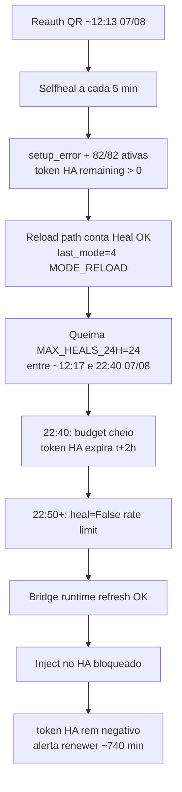
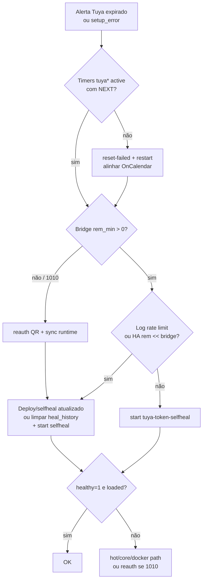

# 2026-08-08 — Tuya: rate limit do selfheal por thrash de reload (não por timer)

**Severidade:** média/alta (alerta «Tuya expirado» + entry `setup_error`; 82 entidades ainda “ativas” em cache)  
**Domínio:** integração Tuya no Home Assistant / `tuya-token-selfheal` / rate limit  
**Status:** corrigido e validado no host (~11:19 -03); fix em PR  
**Relacionado:**
- [2026-08-02 — timer monotônico após reboot](2026-08-02_TUYA_TOKEN_SELFHEAL_TIMER_MONOTONIC_AFTER_REBOOT.md) — **não é esta regressão**
- [2026-08-05 — timers failed + refresh 1010](2026-08-05_TUYA_TIMERS_FAILED_REFRESH_1010_AND_REAUTH.md) — timers nesta outage **saudáveis**

---

## Sintoma

- Alerta do `tuya-token-renewer`: 🔴 **Tuya expirado** — token venceu há ~**740 min**.
- HA: **82/82 entidades ativas** | 13 desabilitadas | 4 scenes ignoradas.
- Config entry Tuya em **`setup_error`** (às vezes `setup_in_progress`).
- Link genérico de reauth (`/config/integrations`) — não distingue rate-limit de 1010.
- Sensação de regressão: “ontem já tinha sido corrigido” (reauth QR ~12:13 de 07/08).

---

## Diagnóstico

### O que **não** foi a causa

| Hipótese (incidentes 02/08 e 05/08) | Status ~11:10 -03 em 08/08 |
|------------------------------------|----------------------------|
| Timer monotônico / `NextElapse=infinity` | **Descartado** — selfheal, renewer e local-key `active` com `Next` wall-clock |
| Unit monotônico no host | **Descartado** — `OnCalendar` + `Persistent=true` |
| Refresh **1010** (access+refresh mortos) | **Descartado** — runtime do bridge ainda renovava (~120 min após refresh) |

### Causa raiz (cadeia)



1. Timers **OK** — o oneshot falha com exit 1 (`healthy=0`), mas o timer **reagenda**.
2. Budget esgotado: `/var/lib/tuya-selfheal/state.json` com **24** entradas em `heal_history` (12:17–22:40 de 07/08); `last_mode=4` (reload), `reloads_total=22`, `heals_total=24`.
3. A partir de **22:50 07/08**:  
   `heal=False (rate limit: 24 heals nas últimas 24h)` e  
   `Tuya degradado sem ação … remaining=-N`.
4. `ensure_fresh_runtime_token` **continua** renovando o bridge **sem** passar pelo rate limit → HA e bridge **divergem**.
5. O renewer só olha o token da **entry HA** → alerta de expirado mesmo com 82 entidades cacheadas e bridge fresco.

### Evidência (homelab)

| Campo | Valor |
|-------|--------|
| HA `token_info.t` (pré-recovery) | 2026-08-07 **20:40:14** -03 |
| HA `expire_time` | 7200 s → expira **22:40:14** 07/08 |
| HA rem ~11:10 08/08 | **≈ −750 min** |
| Bridge runtime rem | **≈ +90–94 min** |
| `tuya_selfheal_healthy` | **0** |
| `tuya_entry_state_code` | **1** (`setup_error`) |
| `tuya_entities_active` | **82** |
| Último heal contado | 2026-08-07 **22:40:11** |

### Por que “ontem já estava corrigido”

- Manhã/meio-dia 07/08: reauth QR + heals restauraram sessão (82/82).
- Tarde/noite 07/08: selfheal **gastou 24/24 heals** quase todos em **reload** no estado zumbi (`setup_error` + entidades ainda ativas).
- À noite o access token do HA expirou; inject automático **bloqueado pelo rate limit** — regressão **sem** 1010 e **sem** timer morto.

---

## Bug de desenho (pré-fix)

Em `tools/homelab/tuya_token_selfheal.py`:

1. Reload com entidades já **> 0** contava como `heal_history` se `wait_recovery` via `active > 0` — no zumbi isso **sempre “sucedia”** e queimava o budget.
2. Rate limit único para reload e inject: budget gasto em thrash impedia o inject legítimo.
3. Refresh do runtime bridge sob rate limit **sem** propagaçao para a entry HA.
4. Alerta do renewer não citava rate limit / bridge fresco → parecia outage de reauth genérica.

---

## Mitigação (código)

| Mudança | Efeito |
|---------|--------|
| `reload_counts_toward_heal_budget(before, after)` | Reload só entra no budget se recuperou **0 → >0** entidades |
| Path reload no `main()` | Zumbi: log *not counted toward heal budget* |
| `should_heal` | **Bypass** de rate limit se `remaining <= 0` e bridge `t` estritamente maior |
| Soft / proativo | Continua sujeito a `MAX_HEALS_24H` |
| Testes | `tests/test_tuya_token_selfheal.py` (bypass, soft rate-limited, contagem de reload) |

Arquivos: `tools/homelab/tuya_token_selfheal.py`, `tests/test_tuya_token_selfheal.py`.

---

## Recovery ops (2026-08-08 ~11:17–11:19 -03)

Com bridge ainda vivo (~88 min):

1. Deploy do script fixado → `/usr/local/bin/tuya_token_selfheal.py`  
   (backup `…bak-20260808-pre-rate-limit-fix`).
2. `sudo systemctl start tuya-token-selfheal.service`.
3. Log:  
   `heal=True (… rate-limit bypass | 82 entidades ainda ativas)`  
   → `hot apply OK` → `Heal OK (hot): 82 entidades | token resta 86 min`.

**QR não foi necessário** (bypass + inject bastaram).

### Prova de saúde

| Métrica | Antes | Depois |
|---------|--------|--------|
| `tuya_selfheal_healthy` | 0 | **1** |
| `tuya_entry_state_code` | 1 (`setup_error`) | **0** (`loaded`) |
| `tuya_token_remaining_minutes` | ~−755 | **~86** |
| `tuya_bridge_token_remaining_minutes` | ~90 | **~86** (alinhado) |
| `tuya_entities_active` | 82 | **82** |
| `tuya_selfheal_last_mode` | 4 (reload) | **1** (hot) |

---

## Runbook (próxima queda com 82 ativas + alerta expirado)



Comandos úteis:

```bash
# Timers
systemctl list-timers 'tuya*' --all
systemctl show tuya-token-selfheal.timer -p ActiveState,NextElapseUSecRealtime

# Budget / divergência
python3 -c "import json; s=json.load(open('/var/lib/tuya-selfheal/state.json')); print(len(s.get('heal_history',[])), s.get('last_mode'), s.get('heals_total'))"
cat /var/lib/prometheus/node-exporter/tuya_token_selfheal.prom | grep -E 'healthy|remaining|entry_state'

# Forçar rodada (pós-fix: bypass se HA morto + bridge fresco)
sudo systemctl start tuya-token-selfheal.service
journalctl -u tuya-token-selfheal.service -n 40 --no-pager

# Só se bridge também morto (1010)
# python3 tools/homelab/tuya_reauth_via_authentik.py --host homelab ...
```

**Não** reauth QR só porque o alerta diz “expirado” — se bridge rem > 0, inject + (se preciso) limpar budget ou confiar no bypass.

---

## Lições

1. **Correção de timer ≠ fim das regressões Tuya.** Esta outage é de **política de rate limit + thrash de reload**.
2. **82/82 ativas ≠ token saudável** — storage da entry pode estar morto com entidades em cache.
3. **Budget único para reload e inject** era a falha crítica: o sistema se “auto-protegia” até ficar cego no momento do inject.
4. **Renewer sem contexto de bridge/rate-limit** gera alerta que parece reauth obrigatória.

---

## Follow-ups

- [x] Não contar reload zumbi no `MAX_HEALS_24H`.
- [x] Bypass de rate limit com HA expirado + bridge fresco.
- [x] Deploy + validação no host (2026-08-08).
- [ ] Merge PR com o fix (e este doc).
- [ ] Opcional: cooldown de reload em `setup_error` estável com entidades já ativas.
- [ ] Opcional: alerta renewer com texto “bridge OK, HA stale / rate-limit” quando aplicável.
- [ ] Opcional: métrica `tuya_selfheal_rate_limited` / contagem de bypass.

---

## Referências

- Selfheal: `tools/homelab/tuya_token_selfheal.py`
- Testes: `tests/test_tuya_token_selfheal.py`
- Unit: `systemd/tuya-token-selfheal.service` (`MAX_HEALS_24H=24`)
- State: `/var/lib/tuya-selfheal/state.json`
- Prom: `/var/lib/prometheus/node-exporter/tuya_token_selfheal.prom`
- Reauth (só se 1010): `tools/homelab/tuya_reauth_via_authentik.py`
- Integração: [SMARTLIFE_TUYA_INTEGRATION.md](../SMARTLIFE_TUYA_INTEGRATION.md)
- PR: https://github.com/eddiejdi/eddie-auto-dev/pull/313
