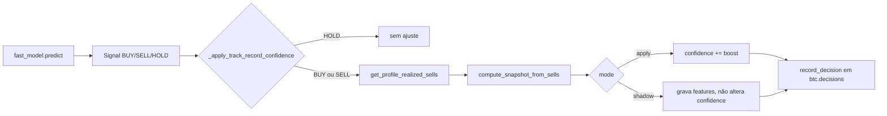

# Track Record Confidence (TRC)

**Status:** em produção (homelab)  
**Data:** 2026-07-12  
**Branch:** `feat/trading-agent-telegram-conversation`  
**Escopo:** todos os perfis ativos (`conservative`, `aggressive`, `shadow`) nas moedas com runtime compartilhado (BTC, ETH, SOL, DOGE)

## Resumo

A feature **Track Record Confidence** ajusta a `confidence` do sinal de trading com base no **histórico realizado de SELLs** do mesmo `symbol` + `profile`, dentro de uma janela configurável (padrão **72h**).

Antes desta feature, `confidence` vinha apenas do `fast_model.py`. O histórico influenciava o agente de forma indireta (`buy_profit_guard`, prompts Ollama, métricas agregadas), mas **não alterava a confiança numérica** usada nos gates de execução.

Com TRC ativo:

1. O modelo gera `raw_confidence`.
2. O módulo calcula um **TRS** (Track Record Score, −1…+1) a partir de SELLs com PnL.
3. O TRS vira um **boost/penalty** assimétrico (+0.10 máx / −0.08 máx por padrão).
4. A confiança final é `clamp(raw_confidence + boost, 0.01, 0.99)` em decisões **BUY** e **SELL**.

## Fluxo no ciclo de decisão



Ponto de integração: `trading_agent.py` chama `_apply_track_record_confidence()` **depois** de `predict()` e **antes** de `record_decision()`.

## Fórmula do TRS

Entrada: até `recent_sell_window` SELLs (padrão 20), com `pnl IS NOT NULL`, no lookback `lookback_hours` (padrão 72h), filtrados por `symbol`, `profile` e `dry_run`.

| Componente | Peso padrão | Cálculo |
|------------|-------------|---------|
| Win rate | 45% | `(wr − 0.5) × 2`, clip −1…+1 |
| PnL acumulado | 30% | `tanh(pnl_usd / pnl_scale_usd)` |
| Streak | 25% | `(winning_streak − losing_streak) / streak_cap`, clip −1…+1 |

Passos:

1. Se `sell_count < min_sell_samples` (padrão 5) → TRS = 0, boost = 0 (neutro).
2. `raw_trs = wr×0.45 + pnl×0.30 + streak×0.25`
3. `sample_confidence = min(1, sell_count / min_sell_samples)`
4. `trs = clip(sample_confidence × raw_trs, −1, +1)`
5. Se `trs ≥ 0` → `boost = trs × max_boost`; senão → `boost = trs × max_penalty`

**Assimetria intencional:** ganhos de confiança até **+0.10**; penalidades até **−0.08**.

`pnl_scale_usd` default por profile (se não definido no JSON):

| Profile | Escala |
|---------|--------|
| conservative | 2.0 USDT |
| aggressive | 5.0 USDT |
| shadow / outros | 3.0 USDT |

## Configuração

Bloco em cada `btc_trading_agent/config_*_{profile}.json`:

```json
"track_record_confidence": {
  "enabled": true,
  "mode": "apply",
  "lookback_hours": 72,
  "min_sell_samples": 5,
  "recent_sell_window": 20,
  "max_boost": 0.1,
  "max_penalty": 0.08,
  "streak_cap": 4,
  "cache_ttl_sec": 30,
  "pnl_scale_usd": 2.0
}
```

| Campo | Descrição |
|-------|-----------|
| `enabled` | Liga/desliga o cálculo |
| `mode` | `apply` altera confidence; `shadow` só grava features (A/B) |
| `lookback_hours` | Janela de SELLs realizados |
| `min_sell_samples` | Mínimo de SELLs para TRS ≠ 0 |
| `recent_sell_window` | Máximo de SELLs considerados (mais recentes primeiro) |
| `max_boost` / `max_penalty` | Tetos assimétricos do ajuste em pontos de confiança |
| `cache_ttl_sec` | Cache em memória por `(symbol, profile, dry_run)` |

## Persistência e observabilidade

### PostgreSQL — `btc.decisions.features`

Cada decisão BUY/SELL com TRC ativo pode conter:

| Campo | Significado |
|-------|-------------|
| `raw_confidence` | Confiança antes do ajuste |
| `track_record_trs` | Score −1…+1 |
| `track_record_boost` | Delta aplicado (ou que seria aplicado em shadow) |
| `track_record_wr` | Win rate no lookback |
| `track_record_sell_count` | Nº de SELLs na amostra |
| `track_record_pnl_usd` | PnL somado na janela |
| `track_record_winning_streak` / `track_record_losing_streak` | Streaks |
| `track_record_mode` | `shadow` quando não aplica o boost |

Consulta útil:

```sql
SELECT
  to_timestamp(timestamp) AS ts,
  profile,
  action,
  confidence AS conf_adj,
  features->>'raw_confidence' AS conf_raw,
  features->>'track_record_trs' AS trs,
  features->>'track_record_boost' AS boost
FROM btc.decisions
WHERE symbol = 'SOL-USDT'
  AND features ? 'track_record_trs'
ORDER BY timestamp DESC
LIMIT 20;
```

Fonte de SELLs: `training_db.get_profile_realized_sells()` em `btc.trades` (`side IN ('sell','sell_reconciled')`, `pnl IS NOT NULL`).

### Prometheus — exporter por instância

Métricas expostas por `prometheus_exporter.py`:

```promql
btc_trading_track_record_trs{coin="SOL-USDT", profile="conservative", servidor="homelab"}
btc_trading_track_record_boost{...}
btc_trading_track_record_wr_lookback{...}
btc_trading_track_record_sell_count{...}
```

Labels: `coin`, `profile`, `servidor` (+ `exported_*` em alguns jobs).

### Grafana — dashboard `btc-trading-monitor`

Seção **📊 Track Record Confidence** (row id 210):

| Painel | ID | Fonte | Conteúdo |
|--------|-----|-------|----------|
| TRS | 204 | Prometheus (range) | Score atual por profile |
| Boost | 205 | Prometheus (range) | Ajuste em pontos de confiança |
| WR lookback | 206 | Prometheus (range) | Win rate na janela |
| Sell count | 207 | Prometheus (range) | Amostras no lookback |
| TRS & Boost ao longo do tempo | 208 | PostgreSQL | Série histórica via `btc.decisions` |
| Decisões recentes | 71 | PostgreSQL | Tabela com `conf_raw`, `conf_adj`, `boost`, `trs` |

**Variáveis do dashboard:** `$servidor`, `$coin`, `$profile` (multi-select; filtros usam `${profile:pipe}` ou `${profile:sqlstring}` conforme o painel).

#### Troubleshooting Grafana

| Sintoma | Causa | Mitigação |
|---------|-------|-----------|
| Stats 204–207 "No data" com range "hoje" | Stats eram `instant` no timestamp `to`; fim do dia BRT ainda no futuro | Corrigido: stats usam **range query** + `lastNotNull` |
| Stats "No data" com `$profile` multi | Regex `profile=~"$profile"` quebrava com vírgula | Usar `${profile:pipe}` nos filtros Prometheus |
| Panel 208 "No data" em zoom 90d | TRC só existe desde o deploy (~12/07/2026) | Usar `now-7d` ou PostgreSQL (panel 208) |
| Panel 208 "No data" com macros antigas | `$__timeGroupAlias` / `$__timeFilter` incompatíveis com PG | Usar `$__unixEpochGroup` + `$__unixEpochFrom/To()` |

## Arquivos principais

| Arquivo | Papel |
|---------|-------|
| `btc_trading_agent/track_record_confidence.py` | TRS, boost, cache, `TrackRecordConfidence` |
| `btc_trading_agent/trading_agent.py` | `_apply_track_record_confidence()` |
| `btc_trading_agent/training_db.py` | `get_profile_realized_sells()` |
| `btc_trading_agent/prometheus_exporter.py` | Métricas `btc_trading_track_record_*` |
| `btc_trading_agent/config_*_*.json` | `track_record_confidence.enabled: true` (14 configs) |
| `grafana/dashboards/btc-trading-monitor.json` | Painéis 204–208, colunas na tabela 71 |
| `tests/test_track_record_confidence.py` | Unitários do módulo |
| `tests/test_track_record_agent_integration.py` | Integração com `BitcoinTradingAgent` |

## Deploy

Runtime de produção: `/apps/crypto-trader/trading/btc_trading_agent/` no homelab (`192.168.15.2`).

```bash
# Sincronizar código + dashboard (script completo)
./scripts/deploy_btc_trading_profiles.sh

# Ou manualmente:
scp grafana/dashboards/btc-trading-monitor.json \
  homelab@192.168.15.2:/home/homelab/monitoring/grafana/provisioning/dashboards/
ssh homelab@192.168.15.2 'docker restart grafana'
```

Após deploy, reiniciar **14×** `crypto-agent@*` e `crypto-exporter@*` (uma instância por moeda×profile).

Validação rápida:

```bash
# Prometheus
curl -sG 'http://192.168.15.2:9090/api/v1/query' \
  --data-urlencode 'query=btc_trading_track_record_trs{coin="SOL-USDT",profile="conservative"}'

# PostgreSQL (via MCP homelab ou psql)
SELECT COUNT(*) FROM btc.decisions
WHERE features ? 'track_record_trs' AND symbol = 'SOL-USDT';
```

## Testes

```bash
pytest tests/test_track_record_confidence.py tests/test_track_record_agent_integration.py -q
```

Cobertura principal:

- neutro com amostra insuficiente;
- boost positivo em sequência vencedora;
- penalidade em losing streak;
- caps assimétricos (+0.10 / −0.08);
- clip de confidence em [0.01, 0.99];
- integração apply vs shadow no agente.

## Modos operacionais

### `mode: apply` (produção atual)

Altera `signal.confidence` antes dos gates (`min_confidence`, execução de ordem). Afeta BUY e SELL.

### `mode: shadow`

Calcula e persiste features sem alterar confidence — útil para comparar impacto antes de promover.

## Impacto esperado (estimativa)

Com base em simulação sobre histórico recente (lookback 72h, caps assimétricos):

- Ganho líquido estimado: **~+US$ 0,72/dia** no portfólio monitorado;
- ~**+27%** vs baseline de confiança fixa (~US$ 2,61/dia).

Tratar como ordem de grandeza, não garantia — depende de regime de mercado e volume de SELLs no lookback.

## Commits de referência

| Commit | Descrição |
|--------|-----------|
| `356a16ce` | Feature TRC (módulo, integração, configs, testes) |
| `80377fac` | Fix panel 208 (PostgreSQL timeseries) |
| `3648e59c` | Fix stats 204–207 (range vs instant) |

## Limitações conhecidas

1. **Cold start:** com menos de 5 SELLs no lookback, TRS permanece 0.
2. **Por profile:** não há cruzamento entre conservative/aggressive/shadow.
3. **Apenas SELLs realizados:** BUYs não entram no score; depósitos/reconciliações sem PnL são ignorados.
4. **Histórico Prometheus curto:** métricas existem desde o deploy; histórico longo está no PostgreSQL (`btc.decisions`).
5. **Cache 30s:** decisões muito próximas reutilizam o mesmo snapshot.

## Wiki

Publicação automática no commit: `docs/TRACK_RECORD_CONFIDENCE.md` → [wiki.rpa4all.com/pt/trading/track-record-confidence](https://wiki.rpa4all.com/pt/trading/track-record-confidence) via `tools/hooks/wiki_sync.py`.

## Rollback

1. Em cada config: `"track_record_confidence": { "enabled": false }`.
2. Redeploy + restart dos agents/exporters.
3. Decisões antigas com features TRC permanecem no banco (somente leitura).

Alternativa reversível: `"mode": "shadow"` mantém telemetria sem alterar confidence.