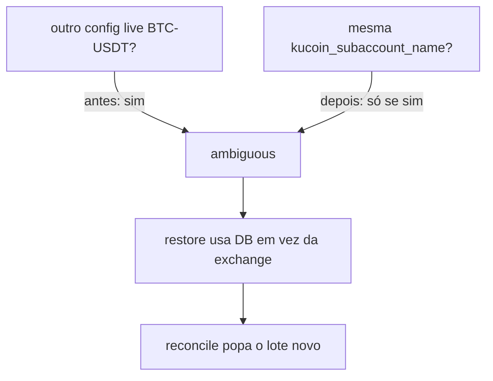

# BTC trading — oportunidades perdidas, slots fantasma e saldo compartilhado

**Data:** 2026-08-13  
**Wiki:** `/trading/trading-btc-phantom-and-shared-balance`  
**Escopo:** `BTC-USDT` conservative / aggressive / shadow. Sem sell sintético. Sem flatten KuCoin.

Síntese operacional do fio Traycer (agent `d9238134`). Fonte viva na época em que foi escrito — o código em disco e o ledger podem ter mudado depois.

## Veredito

Houve perda de oportunidades (bugs + gates). Os 21/31/56 slots do restore **não eram posição KuCoin**. O conservative tratava o saldo como compartilhado com o shadow por um check que olhava o par, não a subconta. Depois dos patches:

| Perfil | Estado ao fim do fio (~10:36 -03) |
|---|---|
| conservative | **1 slot real** 0.00015744 BTC @ $63.514,40 (trade **3886**). Restore sem warning Shared/shadow. |
| shadow | **0 slots**. 72 BUYs `reconciled_phantom`. Exchange 0. Sem sell. |
| aggressive | Sem restart neste fio. JSON de disco agora tem `kucoin_subaccount_name=BTCAgressive`. |

## Linha do tempo

| UTC (aprox.) | O quê |
|---|---|
| Manhã | Diagnóstico: agentes vivos, fills BTC parados desde 09–10/08. RSI flip-flop, `buy_max_exposure` auto-trava, MCP `created_at` quebrado. |
| ~12:15 | Deploy RSI+exposure nos 3 `crypto-agent@BTC_USDT_*` (`intent-20260813-121505-7ced02`). Restore infla 21/31/56 slots. |
| 09:38 -03 | Conservative restore: “Shared BTC … profiles **shadow**” → DB 0.00332 em vez de exchange 0.00015744. Reconcile popa o lote **3886**. |
| 09:44 -03 | Shadow `close_open_buys(balance_zero_on_restore)`: 72 rows closed. Sem sell. |
| 12:59–13:04 | Reconstruct ignora `closed`/`closed_reason`. 72 shadow → `reconciled_phantom`. Restart **só** shadow: 0 slots. |
| 13:09–13:10 | SQL conservative: 3886 desmarcado; 3860 `matched_sell` (3861); 3862 `closed`. Sem restart. |
| 13:27–13:32 | Deploy `trading_agent.py` + `profile_rules.py`. Restart **só** conservative: **1 slot @ $63.514,40**. |
| 13:34–13:36 | JSON prod: conservative=`BTCConservative`, aggressive=`BTCAgressive`. Sem restart. |

Telegram approve estava morto no começo do dia (`callback_query` sem handler; `approval_gateway` `KeyError: 0` no `RealDictCursor`). Corrigido com deploy de `telegram_bot.py` + `approval_gateway.py`. Intents `pending` expiram ~10 min.

## Bugs e correções

### 1. RSI em tick, duas vezes por ciclo

`FastIndicators` carregava candles 1min no boot e depois cada ciclo chamava `update(price)` em `_get_market_state` **e** em `predict`. RSI de 14 pontos em ticks de ~3s saturava 0/100 → `low_confidence`.

**Fix:** um update por ciclo, série em candle 1min. Sem mudar SL/sizing. Arquivo: `btc_trading_agent/fast_model.py`.

### 2. MCP `trading_decisions` / `market_state`

Coluna é `timestamp`, não `created_at`. Default `profile=default` lia dados de abril.

**Fix:** `to_timestamp`; default conservative. `scripts/homelab_mcp_server.py`.

### 3. `buy_max_exposure` e `state.position`

Equity era USDT + só o lote do state. Um lote de ~$15 travava o próximo BUY. State não acompanhava o saldo da subconta.

**Fix:** equity = USDT + base×preço; `state.position` do saldo real. Sem flatten. `position_manager_mixin.py`.

### 4. Reconstruct ressuscitava closed/phantom

`reconstruct_open_buys` ignorava `status` e `metadata.closed_reason`. Restart reabria 56 slots shadow com exchange=0.

**Fix:** `_is_closed_or_phantom_buy`. Testes em `tests/test_position_reconstruction.py`. Produção: `/apps/crypto-trader/trading/btc_trading_agent/position_reconstruction.py`.

### 5. Conservative 3860 vs 3886

| Id | Papel | Ajuste |
|---|---|---|
| **3886** buy 0.00015744 @ 63514.4 | Lote real. Reconcile newest-first marcou `reconciled_phantom`. | Desmarcado (`unmarked_false_phantom`) |
| **3860** buy 0.00023088 | Vendido pelo **3861** (mesmo size, +2h). | `closed` / `matched_sell` |
| **3862** | Phantom sem sell casado. | `status=closed` |

### 6. “Saldo compartilhado com shadow”

`_has_shared_live_symbol_profiles` retornava true se existia **outro config live do mesmo par**. Não lia `kucoin_subaccount_name`. Conservative (`BTCConservative`) e shadow (`BTCAgressive`) **não** compartilham carteira.

`_get_active_symbol_profiles` usava `SUM(buy)−SUM(sell)` da história, incluindo closed. Shadow ficava com net +0.05 por fantasmas.

**Fix (worktree + prod conservative):**

- `_has_shared`: só a mesma subconta (casefold). Vazio não compartilha.
- Net ativo: BUY só se `status<>closed` e sem `closed_reason`.
- Helpers em `profile_rules.py`. Testes em `tests/test_profile_rules.py`.

Aggressive + shadow na **`BTCAgressive`** ainda é saldo compartilhado de verdade.

## Produção (fim do fio)

| Unidade | Nota |
|---|---|
| `crypto-agent@BTC_USDT_conservative` | Restart 13:32 UTC. PID novo. 1 slot 3886. |
| `crypto-agent@BTC_USDT_shadow` | Restart 13:03 UTC. 0 slots. |
| `crypto-agent@BTC_USDT_aggressive` | Sem restart neste fio. |
| JSON cons/aggr | `kucoin_subaccount_name` no disco; processo vivo só lê no próximo boot. |

Baks: `position_reconstruction.py.bak-20260813T130245Z`, `trading_agent.py.bak-20260813T132811Z`, `profile_rules.py.bak-20260813T132811Z`, `config_BTC_USDT_*.json.bak-20260813T133556Z`.

Intents: `121505-7ced02` (RSI+exposure), `125930-c31569` (shadow 72), `130901-d85f81` (3886/3860/3862), `132701-d5f03c` (shared-balance deploy), `133419-88ecbb` (JSON). O `124404-f1890d` expirou por timeout.

## Governança Telegram

Aprovar no botão não gravava: o bot consumia `callback_query` e o gateway usava `row[0]` em `RealDictCursor`. Fix: `telegram_bot._forward_governance_callback` + `_row_intent_id`. Deploy só `eddie-telegram-bot` + `approval-gateway`.

## O que não fazer

- Vender slot fantasma (não há coin).
- Restart conservative/aggressive sem olhar o log: não pode voltar `Shared … shadow` nem 20 slots.
- Assumir que “outro profile do mesmo par” = mesma subconta.
- `intent_complete` em intent `pending`. Deploy/restart exigem Telegram.

## Ainda em aberto

- Stop do conservative é lento (~3 min, thread MarketRAG).
- Aggressive não recebeu o restart do shared-balance (arquivo `.py` já está no diretório compartilhado; módulo na RAM é o antigo até o boot).
- Aggressive e shadow na `BTCAgressive`: restore ainda é ambiguous **de propósito**.
- ETH/SOL/DOGE não foram mexidos.

## Referências no repo

- `btc_trading_agent/position_reconstruction.py`
- `btc_trading_agent/profile_rules.py`
- `btc_trading_agent/trading_agent.py` (`_has_shared_live_symbol_profiles`, `_get_active_symbol_profiles`, `_restore_position`)
- `btc_trading_agent/fast_model.py`
- `btc_trading_agent/position_manager_mixin.py`
- `scripts/homelab_mcp_server.py`
- `telegram_bot.py`, `specialized_agents/approval_gateway.py`
- Testes: `tests/test_position_reconstruction.py`, `tests/test_profile_rules.py`, `tests/test_fast_model.py`, `tests/test_exposure_equity.py`
